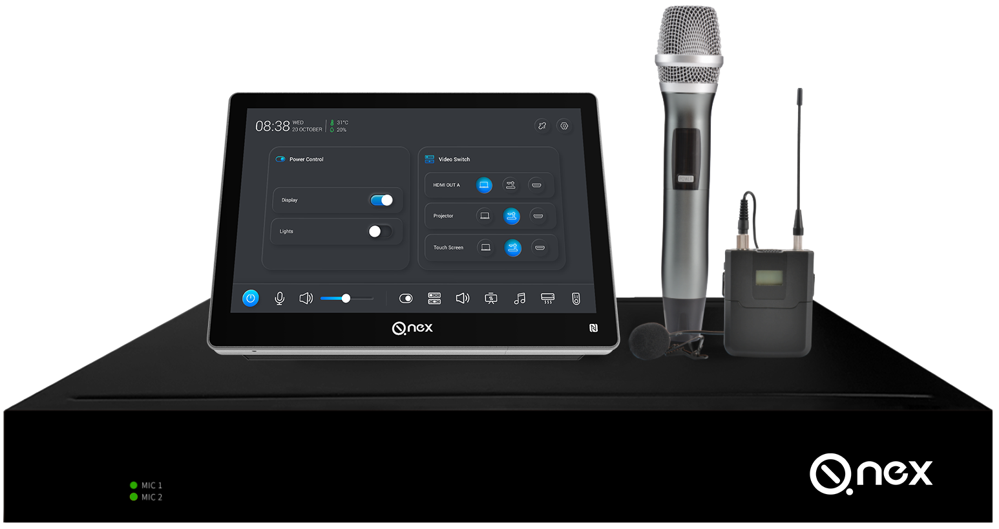
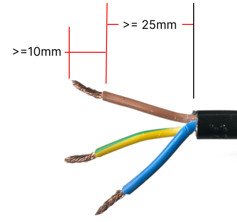
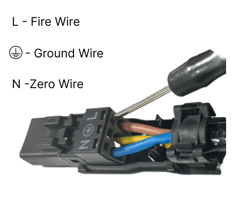
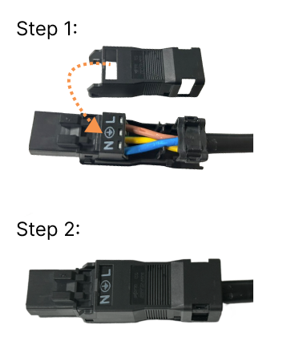
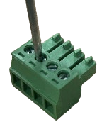
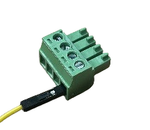
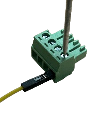

Q-NEX Networked Media Processor

 
NMP211

 
—— User Manual ——

 

Returnstar Interactive Technology Group Co., Ltd.

<!-- break -->

[toc]

# 4. 布线与安装

除了前文介绍的基础功能外，NMP 还具备与教室设备联动的能力，可实现远程控制与高级操作。

为了启用这些高级功能，系统集成商需要完成基本的布线与安装工作。本章节将详细说明将 NMP 集成到教室设备中所需的关键连接与配置方式。

---

## 4.1 安装前准备

### 4.1.1 WAGO 接线端子安装指南

NMP 配备了多个 WAGO 接线端子，分别用于 DISPLAY、UP-DOWN、EXTERNAL 和 POWER 接口。

其中，POWER 接口在出厂前已预接好，其余三个接口需根据实际安装环境的布局及要求，在现场进行接线。

请按照以下步骤正确安装：

| 步骤 | 示意图                                               | 操作说明                                                                 |
| ---- | ---------------------------------------------------- | ------------------------------------------------------------------------ |
| S1   |  | 导线准备 1. 剥除导线末端绝缘层。 请参考图片中的长度要求。 2. 若为多股导线，请先绞合为一股。 |
| S2   |  | 导线接入 WAGO 接线端子 1. 将导线按正确顺序排列至相应接线孔位。 请严格按照火线与零线的顺序接线。 2. 用一字螺丝刀插入导线上方小孔，打开卡扣机构。 3. 轻推导线插入接线孔。 4. 移除螺丝刀，使卡扣自动夹紧导线。 5. 轻拉导线，确认接线牢固。 |
| S3   |  | 安装 WAGO 端子保护盖 1. 将保护盖对准接线端子。 2. 用力按压，直至“咔哒”声确认就位。 |

 警告：

**安装过程中，请勿同时将交流电源的零线与火线（或直流电源的正负极）接入同一个 WAGO 接口，以免造成短路。**

---

### 4.1.2 接线端子排（Terminal Block）安装指南

NMP 还配有多个接线端子排接口，适用于 RS232、PANEL、SPEAKER 与 LOCK 等接口。

这些接线端子需要根据实际安装环境的空间尺寸与控制需求在现场进行配置。

安装步骤如下：

| 步骤 | 示意图                                                        | 操作说明                  |
| ---- | ------------------------------------------------------------- | ------------------------- |
| S1   |  | 逆时针旋转螺丝刀，松开螺丝 |
| S2   |  | 将裸露导线插入接线孔      |
| S3   |  | 顺时针旋转螺丝刀，拧紧螺丝\| |

